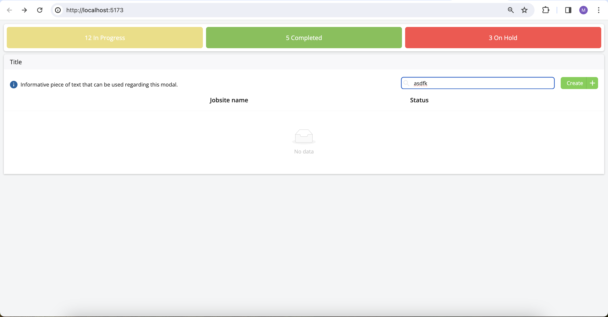

## Features

- Create jobsite
- Update data
- Filter data

##Screnshots

Here are some screenshots of the completed project:





## Prerequisites

Before you begin, ensure you have met the following requirements:

- Node.js and npm installed

## How to Run the App

To run <Project Name>, follow these steps:

```bash
npm install
npm run dev
```

How might you make this app more secure?

- Authorization: By implementing user authentication and authorization, we can ensure that only legitimate users can access certain information and perform specific actions within the app.

How would you make this solution scale to millions of records?

- To scale the app to handle millions of records: Implement pagination to reduce server load and improve user experience.
